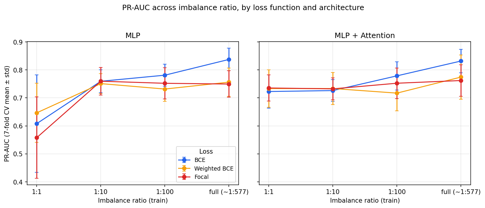
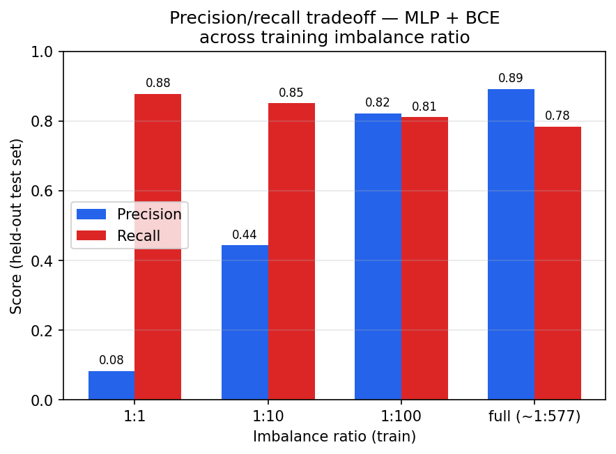
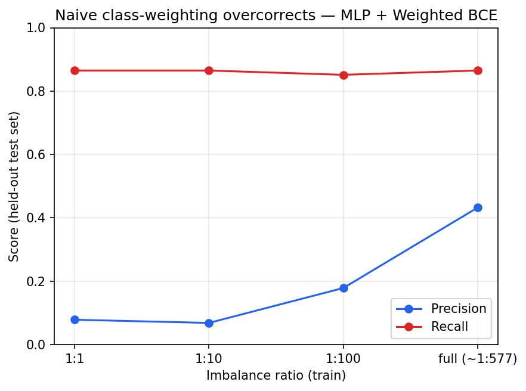

# Deep Learning for Extreme Class-Imbalanced Credit Card Fraud Detection

An empirical study of how deep learning models behave under extreme class imbalance
(~0.17% positive rate), using the ULB Credit Card Fraud dataset. Rather than reporting
a single "best" model, the goal here is to isolate how three factors — **loss
function**, **imbalance ratio in training**, and **architecture** — independently
affect fraud detection performance, and where each one breaks down.

## Approach

- **Model:** dense layers → self-attention block → fraud probability, trained with
  **BCE**, **class-weighted BCE**, and **Focal Loss**
- **Baseline:** plain MLP with the same three losses
- **Experiment axis:** each architecture/loss pair is trained at four imbalance ratios
  — **1:1, 1:10, 1:100, and the natural ~1:577** — via controlled undersampling, to
  isolate the effect of imbalance ratio independently of loss choice and architecture
- **Metrics:** PR-AUC, F1, MCC, and recall @ fixed precision — **not accuracy or
  ROC-AUC**, both of which are close to uninformative at this level of imbalance
- **Validation:** 7-fold cross-validation for every one of the 24 configurations, plus
  a single held-out test evaluation, so results are reported as CV mean ± std rather
  than a single number
- **Interpretability:** SHAP analysis on true positives, false positives, and false
  negatives to characterize *where* the model succeeds and fails, not just how often


## Dataset

`creditcard.csv` from the ULB Credit Card Fraud dataset on Kaggle.

## Repo structure

```
fraud-detection-imbalance/
├── notebooks/
│   └── 01_eda.ipynb
├── src/
│   ├── data_prep.py       # load, scale, split, build imbalance-ratio subsets
│   ├── models.py          # MLP, MLP+Attention architectures
│   ├── losses.py          # Focal Loss implementation
│   ├── train.py           # training loop, CLI
│   ├── evaluate.py        # metrics + confusion matrix + PR curve
│   └── explain.py         # SHAP analysis on TP/FP/FN
├── results/
│   ├── cv_results.csv         # 7-fold CV aggregates, all 24 configs
│   ├── metrics_table.csv      # single held-out-run metrics + CV aggregates
│   └── figures/
├── requirements.txt
├── .gitignore
└── README.md
```

## Results

Full sweep: 2 architectures (`mlp`, `mlp_attention`) × 3 losses (`bce`, `weighted_bce`,
`focal`) × 4 imbalance ratios (`1to1`, `1to10`, `1to100`, `full`) = **24
configurations**, each evaluated with 7-fold CV and a fixed held-out test set (74 fraud
/ ~42,800 legitimate transactions, never resampled).

### Best-performing configuration

By PR-AUC — the primary metric here — the top result is the **plain MLP trained with
BCE at the full, natural imbalance ratio**: PR-AUC 0.837 ± 0.041 (CV mean ± std), F1
0.823 ± 0.034, MCC 0.825 ± 0.033. The attention variant with the same loss and ratio is
a close second (PR-AUC 0.832 ± 0.042, F1 0.819 ± 0.041, MCC 0.819 ± 0.041), and edges
ahead on the single held-out test split for F1, MCC, and recall (0.837 / 0.838 / 0.797
vs. 0.835 / 0.836 / 0.784 for the plain MLP). No configuration dominates on every
metric — the two top configs trade a small amount of precision for recall depending on
which one you pick.

### Key findings

1. **ROC-AUC is not a useful metric at this imbalance level; PR-AUC is.** Across all 24
   configurations, CV-mean PR-AUC ranges from **0.558** (`mlp_focal_1to1`) to **0.837**
   (`mlp_bce_full`) — a genuine ~28-point spread that separates strong configurations
   from weak ones. Reporting accuracy or ROC-AUC alone on a dataset this skewed hides
   almost all of that signal.

2. **Self-attention's effect on PR-AUC is inconsistent, not a uniform lift.** At the
   full ratio with BCE, the plain MLP actually edges out the attention variant on
   PR-AUC (0.837 vs. 0.832, CV mean) — the opposite of a straightforward "attention
   helps" story. Elsewhere it does help: at BCE + 1:100, the attention model reaches
   0.826 PR-AUC on the held-out test set vs. 0.761 for the plain MLP. The honest
   summary is that attention shifts the precision/recall balance and helps in some
   loss/ratio combinations, but it is not a free, consistent win.

3. **Focal loss underperforms both BCE and weighted BCE here, and by a wide margin at
   the full ratio.** `mlp_focal_full` reaches F1 of only **0.096** (CV mean; 0.126 on
   the single test run) — dramatically below `mlp_bce_full`'s 0.823 CV-mean F1. Adding
   attention doesn't rescue it: `mlp_attention_focal_full` scores a similarly low
   **0.104** CV-mean F1. Focal loss's down-weighting of "easy" negatives appears to
   backfire when the training set already reflects the natural, extreme skew — it ends
   up under-flagging fraud rather than focusing on it.

4. **Naive class-weighting (weighted BCE) trades precision for recall aggressively, and
   not always in a useful direction.** Using `pos_weight = n_negative / n_positive`
   pushes precision down to **0.068** at the 1:10 ratio (recall 0.865) for the plain
   MLP — the model floods borderline transactions with fraud flags. At the full ratio
   precision recovers to 0.432 (recall 0.865), which is still far below what BCE
   achieves (0.892 precision at the same recall level). Naive cost-sensitive weighting
   needs threshold calibration to be usable in practice; raising recall via loss
   weighting alone comes at a real precision cost.

5. **Undersampling trades recall for precision predictably.** For plain MLP + BCE,
   moving from a 1:1 to the natural ~1:577 ratio raises precision from **0.082 to
   0.892** while recall falls from **0.878 to 0.784** on the held-out test set — the
   classic imbalance-ratio trade-off, cleanly isolated here because the test set never
   changes across ratios.

### Figures










### SHAP failure analysis (best model: `mlp_bce_full`)

`V14`, `V10`, `V12`, `V4`, and `V17` are consistently the most influential features
across true positives, false positives, and false negatives — consistent with prior
published analyses of this dataset. The interesting difference is in magnitude: SHAP
values for true positives reach substantially higher magnitudes than for false
negatives, which cluster much closer to zero. This suggests the missed fraud cases
aren't ones the model gets confidently wrong — they sit closer to the legitimate
transaction distribution on the features that matter most, i.e., genuine class overlap
that loss reweighting alone cannot resolve.

## Limitations

- The held-out test set contains only **74 fraud cases**. Single-run test metrics
  swing noticeably between configurations for this reason, which is exactly why CV
  mean ± std is reported as the primary number throughout rather than a single split.
- Splits are random, not time-based. Since this is transaction data, a time-ordered
  split (train on earlier transactions, test on later ones) would be a more realistic
  simulation of deployment and is a natural next step.
- All four imbalance ratios are built by undersampling the majority class; no
  oversampling (SMOTE, ADASYN, etc.) or hybrid resampling is tested here.
- Thresholds are left at the default 0.5 cutoff throughout. Several findings above
  (particularly the weighted-BCE precision collapse) would likely look different under
  a calibrated decision threshold — that comparison is left for future work.


